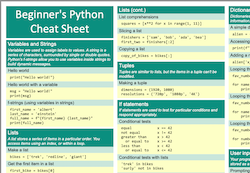

---
hide:
  - footer
title: Cheat Sheets
---

# Cheat Sheets

{ align=right }

Cheat sheets can be really helpful when you’re trying a set of exercises related to a specific topic, or working on a project. Because you can only fit so much information on a single sheet of paper, most cheat sheets are a simple listing of syntax rules. This set of cheat sheets aims to remind you of syntax rules, but also remind you of important concepts as well.

You can download [all of the sheets in a single color document](https://github.com/ehmatthes/pcc_3e/releases/download/v1.0.0/beginners_python_cheat_sheet_pcc_all.pdf). You can also download a [zip file](https://github.com/ehmatthes/pcc_3e/releases/download/v1.0.0/beginners_python_cheat_sheet_all.zip) containing all color and printer-friendly black and white versions.

The full set includes:

- An overview sheet covering a wide range of topics
- A series of sheets that focus on the fundamentals of Python
- A series of sheets focusing on specific libraries: pytest, Pygame, Matplotlib, Plotly, and Django
- A sheet focusing on Git basics

These sheets are completely free to use and share. I originally wrote them as a way to support readers of Python Crash Course, but they've proven useful to people working through a wide range of Python learning resources as well. (If you find them useful and want to see more of my writing on Python, check out my ongoing work at [Mostly Python](https://mostlypython.substack.com).)

---

# Individual Sheet Descriptions

### Overview Sheet

- [Beginner's Python Cheat Sheet](https://github.com/ehmatthes/pcc_3e/releases/download/v1.0.0/beginners_python_cheat_sheet_pcc.pdf)
    - Provides an overview of the basics of Python including variables, lists, dictionaries, functions, classes, and more.

### Python Basics

- Beginner's Python Cheat Sheet - [Lists](https://github.com/ehmatthes/pcc_3e/releases/download/v1.0.0/beginners_python_cheat_sheet_pcc_lists.pdf)
    - Focuses on lists: how to build and modify a list, access elements from a list, and loop through the values in a list. Also covers numerical lists, list comprehensions, tuples, and more.
- Beginner's Python Cheat Sheet - [Dictionaries](https://github.com/ehmatthes/pcc_3e/releases/download/v1.0.0/beginners_python_cheat_sheet_pcc_dictionaries.pdf)
    - Focuses on dictionaries: how to build and modify a dictionary, access the information in a dictionary, and loop through dictionaries in a variety of ways. Includes sections on nesting lists and dictionaries, using dictionary comprehensions, and more.
- Beginner's Python Cheat Sheet - [If Statements and While Loops](https://github.com/ehmatthes/pcc_3e/releases/download/v1.0.0/beginners_python_cheat_sheet_pcc_if_while.pdf)
    - Focuses on `if` statements and `while` loops: how to write conditional tests with strings and numerical data, how to write simple and complex if statements, and how to accept user input. Also covers a variety of approaches to using `while` loops.
- Beginner's Python Cheat Sheet - [Functions](https://github.com/ehmatthes/pcc_3e/releases/download/v1.0.0/beginners_python_cheat_sheet_pcc_functions.pdf)
    - Focuses on functions: how to define a function and how to pass information to a function. Covers positional and keyword arguments, return values, passing lists, using modules, and more
- Beginner's Python Cheat Sheet - [Classes](https://github.com/ehmatthes/pcc_3e/releases/download/v1.0.0/beginners_python_cheat_sheet_pcc_classes.pdf)
    - Focuses on classes: how to define and use a class. Covers attributes and methods, inheritance and importing, and more.
- Beginner's Python Cheat Sheet - [Files and Exceptions](https://github.com/ehmatthes/pcc_3e/releases/download/v1.0.0/beginners_python_cheat_sheet_pcc_files_exceptions.pdf)
    - Focuses on working with files, and using exceptions to handle errors that might arise as your programs run. Covers reading and writing to files, try-except-else blocks, and storing data using the `json` module.
- Beginner's Python Cheat Sheet - [Testing Your Code](https://github.com/ehmatthes/pcc_3e/releases/download/v1.0.0/beginners_python_cheat_sheet_pcc_testing.pdf)
    - Focuses on unit tests and test cases. How to test a function, and how to test a class.

## Project-Focused Sheets

- Beginner's Python Cheat Sheet - [Pygame](https://github.com/ehmatthes/pcc_3e/releases/download/v1.0.0/beginners_python_cheat_sheet_pcc_pygame.pdf)
    - Focuses on creating games with Pygame. Creating a game window, rect objects, images, responding to keyboard and mouse input, groups, detecting collisions between game elements, and rendering text
- Beginner's Python Cheat Sheet - [Matplotlib](https://github.com/ehmatthes/pcc_3e/releases/download/v1.0.0/beginners_python_cheat_sheet_pcc_matplotlib.pdf)
    - Focuses on creating visualizations with Matplotlib. Making line graphs and scatter plots, customizing plots, making multiple plots, and working with time-based data.
- Beginner's Python Cheat Sheet - [Plotly](https://github.com/ehmatthes/pcc_3e/releases/download/v1.0.0/beginners_python_cheat_sheet_pcc_plotly.pdf)
    - Focuses on creating visualizations with Plotly. Making line graphs, scatter plots, and bar graphs, styling plots, making multiple plots, and working with geographical datasets.
- Beginner's Python Cheat Sheet - [Django](https://github.com/ehmatthes/pcc_3e/releases/download/v1.0.0/beginners_python_cheat_sheet_pcc_django.pdf)
    - Focuses on creating web apps with Django. Installing Django and starting a project, working with models, building a home page, using templates, using data, and making user accounts.
- Beginner's Python Cheat Sheet - [Git](https://github.com/ehmatthes/pcc_3e/releases/download/v1.0.0/beginners_python_cheat_sheet_pcc_git.pdf)
    - Focuses on using Git for version control. Installing and configuring Git, initializing a repository, branching, getting started with GitHub, and more.

---

If you find any errors, please feel free to get in touch:

Email: [ehmatthes@gmail.com](mailto:ehmatthes@gmail.com)

Twitter: [@ehmatthes](https://twitter.com/ehmatthes)

Mastodon: [@ehmatthes@fosstodon.org](https://fosstodon.org/@ehmatthes)