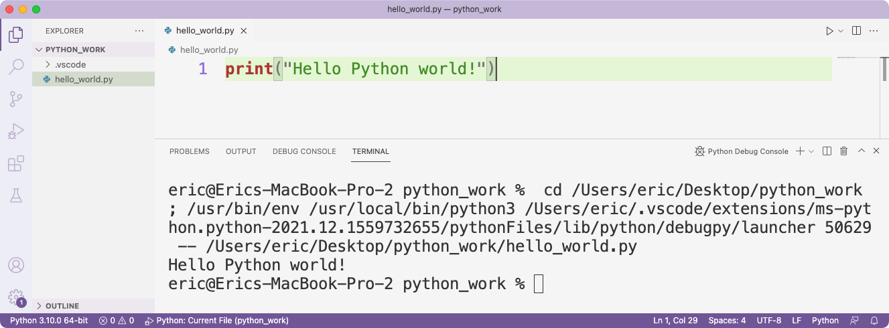
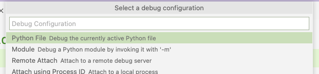

---
hide:
  - footer
title: "Configuring VS Code"
---

# Configuring VS Code

VS Code is a great text editor, with some features that you'd typically see in an IDE. There are some helpful recommendations for configuring VS Code and using it efficiently in Appendix B. This section shows some of those same configuration steps, with more screenshots.

## Simplifying output

By default, VS Code displays output in an *integrated terminal*. This is a terminal window that's embedded within the VS Code application. It's nice because you don't have to have a separate terminal window open to see your output, but it can be confusing because it displays a lot more information than you might want to see when you're running your first programs.

For example, here's what VS Code looks like when you run *hello_world.py*:



The output we're really interested in is the single line *Hello Python world!* The rest of the output shows where the file is being saved, and the path to the  Python interpreter that's being used to run the program. At this point you probably just want to see the output of your program.

To see just the output, do the following:

- Close all open tabs in VS Code, and quit VS Code.
- Launch VS Code again and open the folder that contains the Python files you're working on.
- Click the Run/ Debug icon:


- Click **Create a *launch.json* File**, and select the **Python File** option:



In the `configurations` section, change the `console` setting from `integratedTerminal` to `internalConsole`:

```json title="launch.json" hl_lines="9"
{
    ...
    "configurations": [
        {
            "name": "Python: Current File",
            "type": "python",
            "request": "launch",
            "program": "${file}",
            "console": "internalConsole"
        }
    ]
}
```

Now, run your .py file again and click on the Debug Console tab in the bottom pane. You should see just your program's output:


## Running programs that use `input()`

If you made the above change to display output in the Debug Console instead of the integrated terminal window, you won't be able to run programs that use the `input()` function. The Debug Console is read-only, which means it doesn't accept input. When you're running programs using the `input()` function, which is introduced in Chapter 7, you'll need to switch back to using the integrated terminal.

To do this, open the *launch.json* file that you created earlier, and change `internalConsole` back to `integratedTerminal`:

```json title="launch.json" hl_lines="9"
{
    ...
    "configurations": [
        {
            "name": "Python: Current File",
            "type": "python",
            "request": "launch",
            "program": "${file}",
            "console": "integratedTerminal"
        }
    ]
}
```

## Switching between the editor and the terminal

When you're running programs that use `input()`, you'll need to switch between the editor pane where you're typing code, and the terminal where you'll enter input. You can use a mouse or a trackpad, but there's a keyboard shortcut that's really helpful.

When you're finished entering code in the editor pane, press `Ctrl-F5` to run your program. You'll see a prompt in the terminal pane where you can enter the input for the program. Press `` Ctrl-` `` (Control-backtick) to switch from the editor pane to the terminal pane. When you're finished entering input, press `` Ctrl-` `` again to move the cursor back to the editor window.
