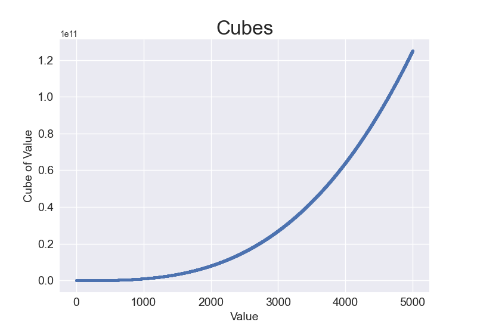
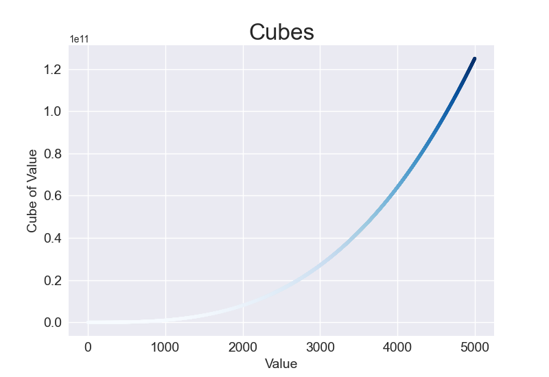
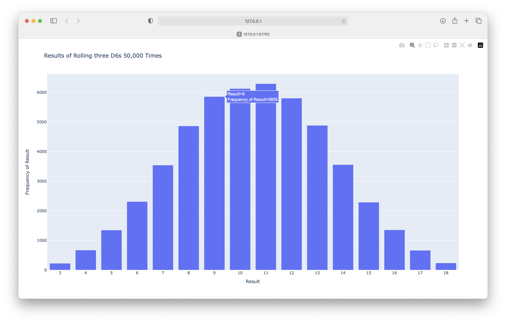
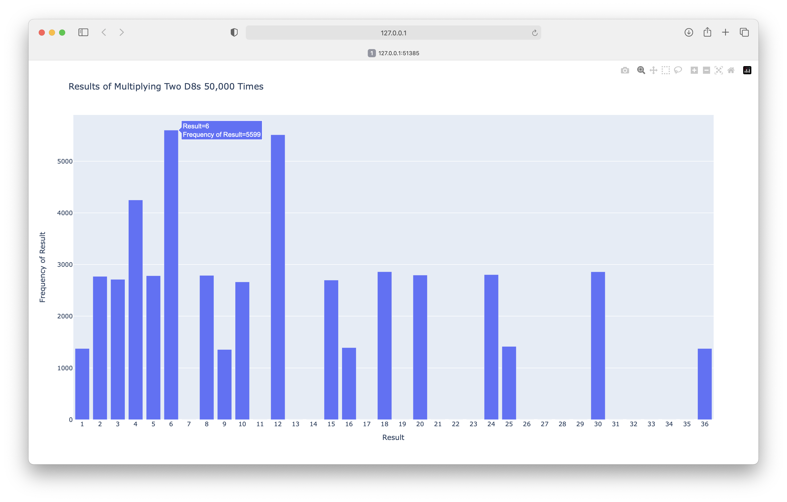

---
hide:
  - footer
title: "Solutions: Chapter 15"
---

# Solutions - Chapter 15

---

## 15-1: Cubes

A number raised to the third power is a *cube*. Plot the first five cubic numbers, and then plot the first 5,000 cubic numbers.

```python title="cubes_5.py"
import matplotlib.pyplot as plt

# Define data.
x_values = [1, 2, 3, 4, 5]
cubes = [1, 8, 27, 64, 125]

# Make plot.
plt.style.use('seaborn-v0_8')
fig, ax = plt.subplots()
ax.scatter(x_values, cubes, s=40)

# Set chart title and label axes.
ax.set_title("Cubes", fontsize=24)
ax.set_xlabel('Value', fontsize=14)
ax.set_ylabel('Cube of Value', fontsize=14)

# Set size of tick labels.
ax.tick_params(axis='both', labelsize=14)

# Show plot.
plt.show()
```

Output:


Plotting 5000 cubes:

```python title="cubes_5000.py"
import matplotlib.pyplot as plt

# Define data.
x_values = range(1, 5001)
y_values = [x**3 for x in x_values]

# Make plot.
plt.style.use('seaborn-v0_8')
fig, ax = plt.subplots()
ax.scatter(x_values, y_values, c=y_values, cmap=plt.cm.Blues, s=10)

# Set chart title and label axes.
ax.set_title("Cubes", fontsize=24)
ax.set_xlabel('Value', fontsize=14)
ax.set_ylabel('Cube of Value', fontsize=14)

# Set size of tick labels.
ax.tick_params(axis='both', labelsize=14)

# Show plot.
plt.show()
```

Output:



## 15-2: Colored Cubes

Apply a colormap to your cubes plot.

```python title="colored_cubes.py"
import matplotlib.pyplot as plt

# Define data.
x_values = range(1, 5001)
y_values = [x**3 for x in x_values]

# Make plot.
plt.style.use('seaborn-v0_8')
fig, ax = plt.subplots()
ax.scatter(x_values, y_values, c=y_values, cmap=plt.cm.Blues, s=10)

# Set chart title and label axes.
ax.set_title("Cubes", fontsize=24)
ax.set_xlabel('Value', fontsize=14)
ax.set_ylabel('Cube of Value', fontsize=14)

# Set size of tick labels.
ax.tick_params(axis='both', labelsize=14)

# Show plot.
plt.show()
```

Output:



## 15-3: Molecular Motion

Modify *rw_visual.py* by replacing `ax.scatter()` with `ax.plot()`. To simulate the path of a pollen grain on the surface of a drop of water, pass in the `rw.x_values` and `rw.y_values`, and include a `linewidth` argument. Use 5,000 instead of 50,000 points to keep the plot from being too busy.

```python title="molecular_motion.py"
import matplotlib.pyplot as plt

from random_walk import RandomWalk

# Make a random walk.
rw = RandomWalk(5_000)
rw.fill_walk()

# Plot the points in the walk.
plt.style.use('classic')
fig, ax = plt.subplots()
point_numbers = range(rw.num_points)
ax.plot(rw.x_values, rw.y_values, linewidth=1)
ax.set_aspect('equal')

# Emphasize the first and last points.
ax.scatter(0, 0, c='green', edgecolors='none', s=100)
ax.scatter(rw.x_values[-1], rw.y_values[-1], c='red', edgecolors='none',
        s=100)

# Remove the axes.
ax.get_xaxis().set_visible(False)
ax.get_yaxis().set_visible(False)

plt.show()
```

Output:


## 15-5: Refactoring

The `fill_walk()` method is lengthy. Create a new method called `get_step()` to determine the direction and distance for each step, and then calculate the step. You should end up with two calls to `get_step()` in `fill_walk()`:

```python
x_step = self.get_step()
y_step = self.get_step()
```

This refactoring should reduce the size of `fill_walk()` and make the method easier to read and understand.

```python title="random_walk_refactored.py"
from random import choice


class RandomWalk:
    """A class to generate random walks."""

    def __init__(self, num_points=5000):
        """Initialize attributes of a walk."""
        self.num_points = num_points

        # All walks start at (0, 0).
        self.x_values = [0]
        self.y_values = [0]

    def fill_walk(self):
        """Calculate all the points in the walk."""
        # Keep taking steps until the walk reaches the desired length.
        while len(self.x_values) < self.num_points:

            # Decide which direction to go, and how far to go.
            x_step = self.get_step()
            y_step = self.get_step()

            # Reject moves that go nowhere.
            if x_step == 0 and y_step == 0:
                continue

            # Calculate the new position.
            x = self.x_values[-1] + x_step
            y = self.y_values[-1] + y_step

            self.x_values.append(x)
            self.y_values.append(y)

    def get_step(self):
        """Calculate a single step in the walk."""
        direction = choice([1, -1])
        distance = choice([0, 1, 2, 3, 4])
        step = direction * distance

        return step
```

## 15-6: Two D8s

Create a simulation showing what happens when you roll two eight-sided dice 1,000 times. Try to picture what you think the visualization will look like before you run the simulation, then see if your intuition was correct. Gradually increase the number of rolls until you start to see the limits of your system’s capabilities.

```python title="two_d8.py"
import plotly.express as px

from die import Die


# Create two D8s.
die_1 = Die(8)
die_2 = Die(8)

# Make some rolls, and store results in a list.
results = []
for roll_num in range(50_000):
    result = die_1.roll() + die_2.roll()
    results.append(result)

# Analyze the results.
frequencies = []
max_result = die_1.num_sides + die_2.num_sides
poss_results = range(2, max_result+1)
for value in poss_results:
    frequency = results.count(value)
    frequencies.append(frequency)

# Visualize the results.
title = "Results of Rolling two D8s 50,000 Times"
labels = {'x': 'Result', 'y': 'Frequency of Result'}
fig = px.bar(x=poss_results, y=frequencies, title=title, labels=labels)

# Further customize chart.
fig.update_layout(xaxis_dtick=1)
              
fig.show()
```

Output:


## 15-7: Three Dice

When you roll three D6 dice, the smallest number you can roll is 3 and the largest number is 18. Create a visualization that shows what happens when you roll three D6 dice.

```python title="three_dice.py"
import plotly.express as px

from die import Die


# Create three D6s.
die_1 = Die()
die_2 = Die()
die_3 = Die()

# Make some rolls, and store results in a list.
results = []
for roll_num in range(50_000):
    result = die_1.roll() + die_2.roll() + die_3.roll()
    results.append(result)

# Analyze the results.
frequencies = []
max_result = die_1.num_sides + die_2.num_sides + die_3.num_sides
poss_results = range(3, max_result+1)
for value in poss_results:
    frequency = results.count(value)
    frequencies.append(frequency)

# Visualize the results.
title = "Results of Rolling three D6s 50,000 Times"
labels = {'x': 'Result', 'y': 'Frequency of Result'}
fig = px.bar(x=poss_results, y=frequencies, title=title, labels=labels)

# Further customize chart.
fig.update_layout(xaxis_dtick=1)
              
fig.show()
```

Output:



## 15-8: Multiplication

When you roll two dice, you usually add the two numbers together to get the result. Create a visualization that shows what happens if you multiply these numbers by each other instead.

```python title="multiplication.py"
import plotly.express as px

from die import Die


# Create two D6s.
die_1 = Die()
die_2 = Die()

# Make some rolls, and store results in a list.
results = []
for roll_num in range(50_000):
    result = die_1.roll() * die_2.roll()
    results.append(result)

# Analyze the results.
frequencies = []
max_result = die_1.num_sides * die_2.num_sides
poss_results = range(1, max_result+1)
for value in poss_results:
    frequency = results.count(value)
    frequencies.append(frequency)

# Visualize the results.
title = "Results of Multiplying Two D8s 50,000 Times"
labels = {'x': 'Result', 'y': 'Frequency of Result'}
fig = px.bar(x=poss_results, y=frequencies, title=title, labels=labels)

# Further customize chart.
fig.update_layout(xaxis_dtick=1)
              
fig.show()
```

Output:



## 15-9: Die Comprehensions

For clarity, the listings in this section use the long form of `for` loops. If you’re comfortable using list comprehensions, try writing a comprehension for one or both of the loops in each of these programs.

```python title="die_comprehension.py"
import plotly.express as px

from die import Die


# Create a D6 and a D10.
die_1 = Die()
die_2 = Die(10)

# Make some rolls, and store results in a list.
results = [die_1.roll() + die_2.roll() for roll_num in range(50_000)]

# Analyze the results.
max_result = die_1.num_sides + die_2.num_sides
poss_results = range(2, max_result+1)

frequencies = [results.count(value) for value in poss_results]

# Visualize the results.
title = "Results of Rolling a D6 and a D10 50,000 Times"
labels = {'x': 'Result', 'y': 'Frequency of Result'}
fig = px.bar(x=poss_results, y=frequencies, title=title, labels=labels)

# Further customize chart.
fig.update_layout(xaxis_dtick=1)
              
fig.show()
```

Output:


