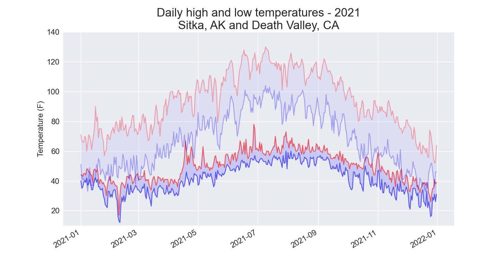
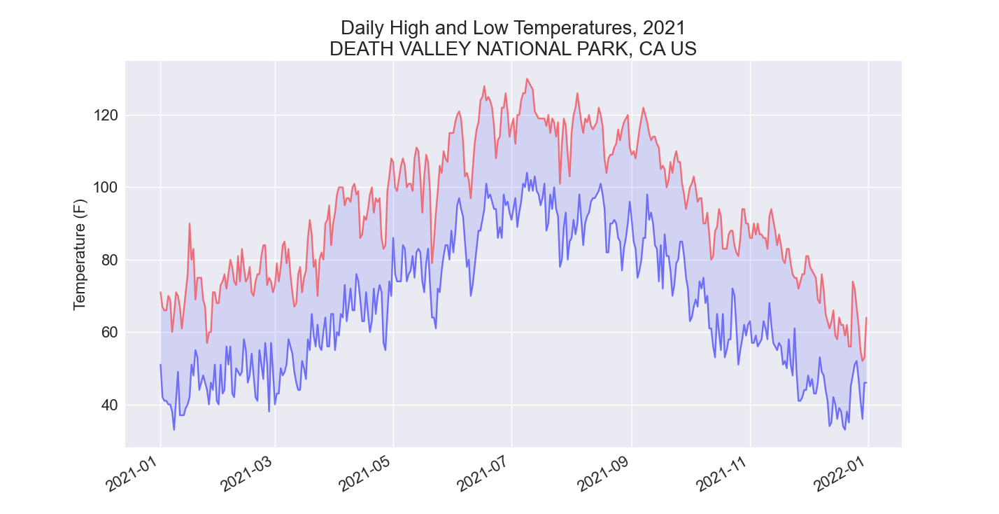
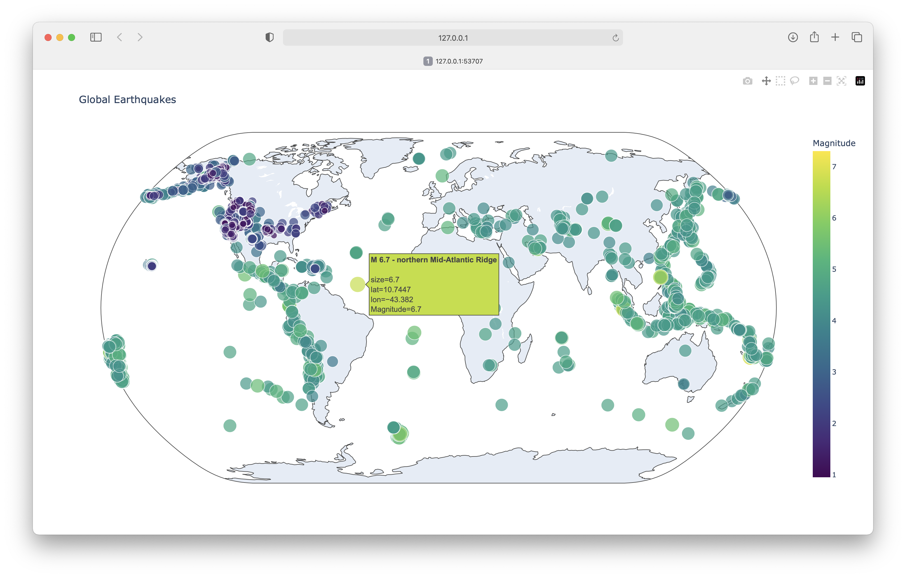
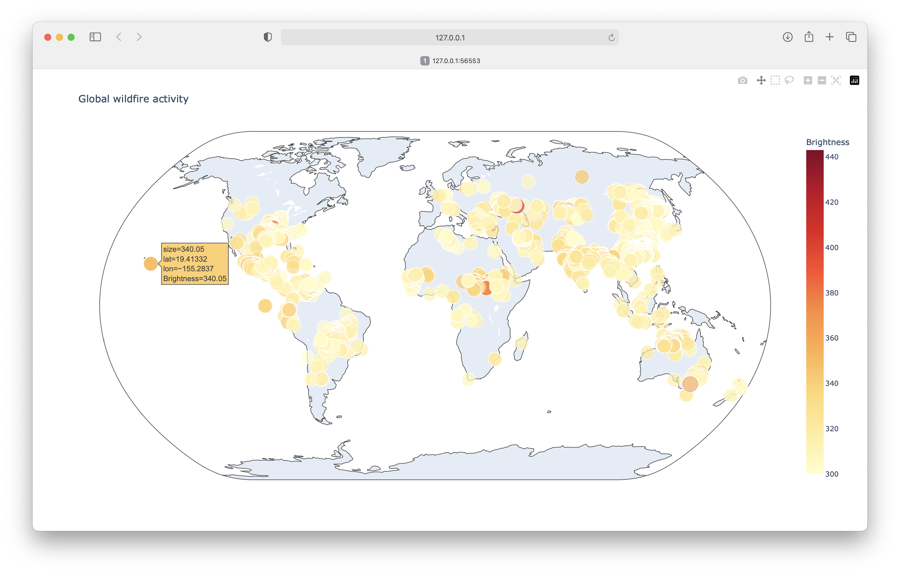

---
hide:
  - footer
title: "Solutions: Chapter 16"
---

# Solutions - Chapter 16

---

## 16-1: Sitka Rainfall

Sitka is located in a temperate rainforest, so it gets a fair amount of rainfall. In the data file *sitka_weather_2021_full.csv* is a header called `PRCP`, which represents daily rainfall amounts. Make a visualization focusing on the data in this column. You can repeat the exercise for Death Valley if you’re curious how little rainfall occurs in a desert.

```python title="sitka_rainfall.py"
from pathlib import Path
import csv
from datetime import datetime

import matplotlib.pyplot as plt


path = Path('weather_data/sitka_weather_2021_full.csv')
lines = path.read_text().splitlines()

reader = csv.reader(lines)
header_row = next(reader)

# Extract dates and rainfall amounts
dates, precips = [], []
for row in reader:
    current_date = datetime.strptime(row[2], '%Y-%m-%d')
    precip = float(row[5])
    dates.append(current_date)
    precips.append(precip)

# Plot the high temperatures.
plt.style.use('seaborn-v0_8')
fig, ax = plt.subplots()
ax.bar(dates, precips, color='blue')

# Format plot.
ax.set_title("Daily Precipitation, 2021", fontsize=24)
ax.set_xlabel('', fontsize=16)
fig.autofmt_xdate()
ax.set_ylabel("Precipitation Amount (in)", fontsize=16)
ax.tick_params(labelsize=16)

plt.show()
```

Output:


## 16-2: Sitka–Death Valley Comparison

The temperature scales on the Sitka and Death Valley graphs reflect the different data ranges. To accurately compare the temperature range in Sitka to that of Death Valley, you need identical scales on the y-axis. Change the settings for the y-axis on one or both of the charts in Figures 16-5 and 16-6. Then make a direct comparison between temperature ranges in Sitka and Death Valley (or any two places you want to compare).

The `set_ylim()` [method](https://matplotlib.org/stable/api/_as_gen/matplotlib.axes.Axes.set_ylim.html) allows you to set the limits of just the y-axis. If you ever need to specify the limits of the x-axis, there’s a corresponding `set_xlim()` function as well.

```python title="sitka_highs_lows_comparison.py"
from pathlib import Path
import csv
from datetime import datetime

import matplotlib.pyplot as plt


path = Path('weather_data/sitka_weather_2021_simple.csv')
lines = path.read_text().splitlines()

reader = csv.reader(lines)
header_row = next(reader)

# Extract dates, and high and low temperatures.
dates, highs, lows = [], [], []
for row in reader:
    current_date = datetime.strptime(row[2], '%Y-%m-%d')
    high = int(row[4])
    low = int(row[5])
    dates.append(current_date)
    highs.append(high)
    lows.append(low)

# Plot the high and low temperatures.
plt.style.use('seaborn-v0_8')
fig, ax = plt.subplots()
ax.plot(dates, highs, color='red', alpha=0.5)
ax.plot(dates, lows, color='blue', alpha=0.5)
ax.fill_between(dates, highs, lows, facecolor='blue', alpha=0.1)

# Format plot.
ax.set_title("Daily High and Low Temperatures, 2021", fontsize=24)
ax.set_xlabel('', fontsize=16)
fig.autofmt_xdate()
ax.set_ylabel("Temperature (F)", fontsize=16)
ax.tick_params(labelsize=16)
ax.set_ylim(10, 140)

plt.show()
```

Output:


Using the same limits for the `ylim()` method with the Death Valley data results in a chart that has the same scale:


There are a number of ways you can approach plotting both data sets on the same chart. In the following solution, we put the code for reading the csv file into a function. We then call it once to grab the highs and lows for Sitka before making the chart, and then call the function a second time to add Death Valley’s data to the existing plot. The colors have been adjusted slightly to make each location’s data distinct.

```python title="sitka_death_valley_comparison.py"
from pathlib import Path
import csv
from datetime import datetime

import matplotlib.pyplot as plt


def get_weather_data(path, dates, highs, lows, date_index, high_index,
        low_index):
    """Get the highs and lows from a data file."""
    lines = path.read_text().splitlines()
    reader = csv.reader(lines)
    header_row = next(reader)

    # Extract dates, and high and low temperatures.
    for row in reader:
        current_date = datetime.strptime(row[date_index], '%Y-%m-%d')
        try:
            high = int(row[high_index])
            low = int(row[low_index])
        except ValueError:
            print(f"Missing data for {current_date}")
        else:
            dates.append(current_date)
            highs.append(high)
            lows.append(low)

# Get weather data for Sitka.
path = Path('weather_data/sitka_weather_2021_simple.csv')
dates, highs, lows = [], [], []
get_weather_data(path, dates, highs, lows, date_index=2, high_index=4,
        low_index=5)

# Plot weather data for Sitka.
plt.style.use('seaborn-v0_8')
fig, ax = plt.subplots()
ax.plot(dates, highs, color='red', alpha=0.6)
ax.plot(dates, lows, color='blue', alpha=0.6)
ax.fill_between(dates, highs, lows, facecolor='blue', alpha=0.15)

# Get weather data for Death Valley.
path = Path('weather_data/death_valley_2021_simple.csv')
dates, highs, lows = [], [], []
get_weather_data(path, dates, highs, lows, date_index=2, high_index=3,
        low_index=4)

# Add Death Valley weather data to current plot.
ax.plot(dates, highs, color='red', alpha=0.3)
ax.plot(dates, lows, color='blue', alpha=0.3)
ax.fill_between(dates, highs, lows, facecolor='blue', alpha=0.05)

# Format plot.
title = "Daily high and low temperatures - 2021"
title += "\nSitka, AK and Death Valley, CA"
ax.set_title(title, fontsize=24)
ax.set_xlabel('', fontsize=16)
fig.autofmt_xdate()
ax.set_ylabel("Temperature (F)", fontsize=16)
ax.tick_params(labelsize=16)
ax.set_ylim(10, 140)

plt.show()
```

Output:



## 16-4: Automatic Indexes

In this section, we hardcoded the indexes corresponding to the `TMIN` and `TMAX` columns. Use the header row to determine the indexes for these values, so your program can work for Sitka or Death Valley. Use the station name to automatically generate an appropriate title for your graph as well.

The `index()` method returns the index of an item in a list. For example:

```
>>> animals = ['cat', 'dog', 'mouse', 'elephant']
>>> animals.index('dog')
1
```

This can help us pull the indexes of the headers we want from the header row:

```python title="automatic_indexes.py"
from pathlib import Path
import csv
from datetime import datetime

import matplotlib.pyplot as plt


path = Path('weather_data/death_valley_2021_simple.csv')
lines = path.read_text().splitlines()

reader = csv.reader(lines)
header_row = next(reader)

date_index = header_row.index('DATE')
high_index = header_row.index('TMAX')
low_index = header_row.index('TMIN')
name_index = header_row.index('NAME')

# Extract dates, and high and low temperatures.
dates, highs, lows = [], [], []
place_name = ""
for row in reader:
    # Grab the station name, if it's not already set.
    if not place_name:
        place_name = row[name_index]

    current_date = datetime.strptime(row[date_index], '%Y-%m-%d')
    try:
        high = int(row[high_index])
        low = int(row[low_index])
    except ValueError:
        print(f"Missing data for {current_date}")
    else:
        dates.append(current_date)
        highs.append(high)
        lows.append(low)

# Plot the high and low temperatures.
plt.style.use('seaborn-v0_8')
fig, ax = plt.subplots()
ax.plot(dates, highs, color='red', alpha=0.5)
ax.plot(dates, lows, color='blue', alpha=0.5)
ax.fill_between(dates, highs, lows, facecolor='blue', alpha=0.1)

# Format plot.
title = f"Daily High and Low Temperatures, 2021\n{place_name}"
ax.set_title(title, fontsize=20)
fig.autofmt_xdate()
ax.set_ylabel("Temperature (F)", fontsize=16)
ax.tick_params(labelsize=16)

plt.show()
```

Output:



## 16-6: Refactoring

The loop that pulls data from `all_eq_dicts` uses variables for the magnitude, longitude, latitude, and title of each earthquake before appending these values to their appropriate lists. This approach was chosen for clarity in how to pull data from a GeoJSON file, but it’s not necessary in your code. Instead of using these temporary variables, pull each value from `eq_dict` and append it to the appropriate list in one line. Doing so should shorten the body of this loop to just four lines.

```python title="eq_world_map_refactored.py"
from pathlib import Path
import json

import plotly.express as px


# Read data as a string and convert to a Python object.
path = Path('eq_data/eq_data_30_day_m1.geojson')
contents = path.read_text()
all_eq_data = json.loads(contents)

# Examine all earthquakes in the dataset.
all_eq_dicts = all_eq_data['features']

mags, lons, lats, eq_titles = [], [], [], []
for eq_dict in all_eq_dicts:
    mags.append(eq_dict['properties']['mag'])
    lons.append(eq_dict['geometry']['coordinates'][0])
    lats.append(eq_dict['geometry']['coordinates'][1])
    eq_titles.append(eq_dict['properties']['title'])

title = 'Global Earthquakes'
fig = px.scatter_geo(lat=lats, lon=lons, size=mags, title=title,
        color=mags,
        color_continuous_scale='Viridis',
        labels={'color':'Magnitude'},
        projection='natural earth',
        hover_name=eq_titles,
    )
fig.show()
```

Output:



## 16-6: Automated Title

In this section, we used the generic title *Global Earthquakes*. Instead, you can use the title for the dataset in the `metadata` part of the GeoJSON file. Pull this value and assign it to the variable title.

```python title="eq_world_map_automated_title.py"
from pathlib import Path
import json

import plotly.express as px


# Read data as a string and convert to a Python object.
path = Path('eq_data/eq_data_30_day_m1.geojson')
contents = path.read_text()
all_eq_data = json.loads(contents)

# Examine all earthquakes in the dataset.
title = all_eq_data['metadata']['title']
all_eq_dicts = all_eq_data['features']

mags, lons, lats, eq_titles = [], [], [], []
for eq_dict in all_eq_dicts:
    mags.append(eq_dict['properties']['mag'])
    lons.append(eq_dict['geometry']['coordinates'][0])
    lats.append(eq_dict['geometry']['coordinates'][1])
    eq_titles.append(eq_dict['properties']['title'])

fig = px.scatter_geo(lat=lats, lon=lons, size=mags, title=title,
        color=mags,
        color_continuous_scale='Viridis',
        labels={'color':'Magnitude'},
        projection='natural earth',
        hover_name=eq_titles,
    )
fig.show()
```

Output:


## 16-9: World Fires

In the resources for this chapter, you’ll find a file called *world_fires_1_day.csv*. This file contains information about fires burning in different locations around the globe, including the latitude, longitude, and brightness of each fire. Using the data-processing work from the first part of this chapter and the mapping work from this section, make a map that shows which parts of the world are affected by fires.

You can download more recent versions of this data at [https://earthdata.nasa.gov/earth-observation-data/near-real-time/firms/active-fire-data](https://earthdata.nasa.gov/earth-observation-data/near-real-time/firms/active-fire-data). You can find links to the data in CSV format in the SHP, KML, and TXT Files section.

***Note:** Global fire activity can be highly variable, so the size of this dataset can vary widely depending on when you happen to download it. Using all of the data may slow your system down too much. If that happens, make a copy of the original data file but only keep the first 5,000 rows, or however many rows your system can handle in a reasonable amount of processing time.*

```python title="world_fires.py"
from pathlib import Path
import csv

import plotly.express as px


path = Path('eq_data/world_fires_1_day.csv')
lines = path.read_text().splitlines()

reader = csv.reader(lines)
header_row = next(reader)

# Extract lat, lon, brightness
lats, lons, brights = [], [], []
for row in reader:
    try:
        lat = float(row[0])
        lon = float(row[1])
        bright = float(row[2])
    except ValueError:
        # Show raw date information for invalid rows.
        print(f"Invalid data for {row[5]}")
    else:
        lats.append(lat)
        lons.append(lon)
        brights.append(bright)

# Plot brightnesses on a world map.
title = "Global wildfire activity"
fig = px.scatter_geo(lat=lats, lon=lons, size=brights, title=title,
        color=brights,
        color_continuous_scale='Viridis',
        labels={'color':'Brightness'},
        projection='natural earth',
    )

fig.show()
```

Output:


