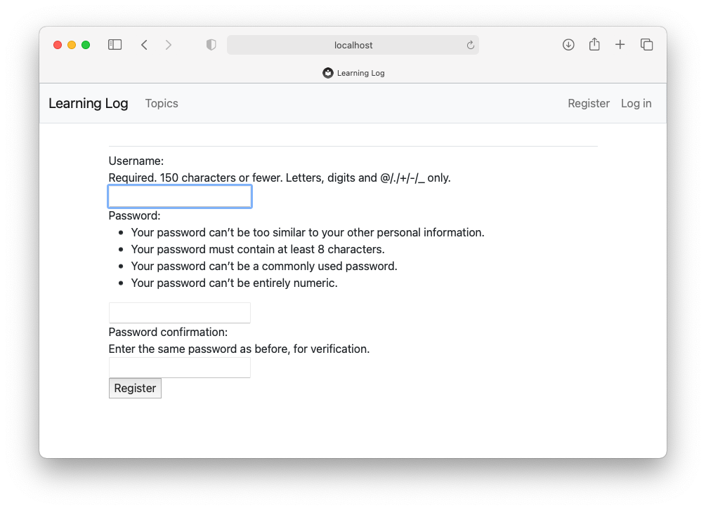
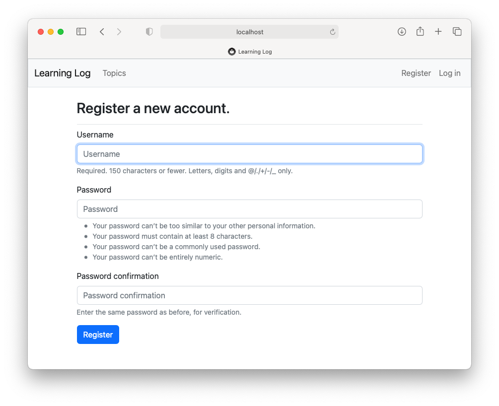

---
hide:
  - footer
title: "Solutions: Chapter 20"
---

# Solutions - Chapter 20

---

## 20-1: Other Forms

We applied Bootstrap’s styles to the login page. Make similar changes to the rest of the form-based pages, including `new_topic`, `new_entry`, `edit_entry`, and `register`.

*The full solution is [here](https://github.com/ehmatthes/pcc_3e/tree/main/solution_files/chapter_20/ex_20_1_other_forms). Here's the register page before styling, and after styling:*





## 20-2: Stylish Blog

Use Bootstrap to style the Blog project you created in Chapter 19.

*The full solution is [here](https://github.com/ehmatthes/pcc_3e/tree/main/solution_files/chapter_20/ex_20_2_stylish_blog). It may help to look at the Bootstrap documentation for styling [cards](https://getbootstrap.com/docs/5.2/components/card/) and [text](https://getbootstrap.com/docs/5.2/utilities/text/). Here's the home page, after applying styles similar to what Learning Log uses:*


## 20-3: Live Blog

Deploy the Blog project you’ve been working on to Platform.sh. Make sure you set `DEBUG` to `False`, so users don’t see the full Django error pages when something goes wrong.

***Note:** When you run `platform create`, make sure you use the name `blog_project` when you create the project, and in your settings files:*

```
(b_env)$ platform create
* Project title (--title)
Default: Untitled Project
> blog_project

* Region (--region)
The region where the project will be hosted
  [au.platform.sh  ] Sydney, Australia (AWS) [867 gC02eq/kWh]
  [au-2.platform.sh] Sydney, Australia (AZURE) [867 gC02eq/kWh]
  ...
> us-3.platform.sh

* Plan (--plan)
The subscription plan
Default: development
Enter a number to choose: 
  [0 ] development
  [1 ] standard
  ...
> 0

* Environments (--environments)
The number of environments
Default: 3
> 3

* Storage (--storage)
The amount of storage per environment, in GiB
Default: 5
> 5
```

*The full solution is [here](https://github.com/ehmatthes/pcc_3e/tree/main/solution_files/chapter_20/ex_20_3_live_blog).*

## 20-4: Extended Learning Log

Add one feature to Learning Log, and push the change to your live deployment. Try a simple change, such as writing more about the project on the home page. Then try adding a more advanced feature, such as giving users the option of making a topic public. This would require an attribute called `public` as part of the `Topic` model (this should be set to `False` by default) and a form element on the new_topic page that allows the user to change a topic from private to public. You’d then need to migrate the project and revise *views.py* so any topic that’s public is visible to unauthenticated users as well.

*Giving users the option to make some of their topics public is a fairly involved task, if Learning Log is your first experience with Django. It may be helpful to look at some specific parts of the documentation, if you're trying to implement this feature:*

- The [Model Field Reference](https://docs.djangoproject.com/en/4.1/ref/models/fields/) tells you all about the different kinds of fields you can use in a *models.py* file, and the settings you can use for those fields.
    - Using [default values](https://docs.djangoproject.com/en/4.1/ref/models/fields/#default) for a field
    - [BooleanField](https://docs.djangoproject.com/en/4.1/ref/models/fields/#booleanfield)
- [Making queries](https://docs.djangoproject.com/en/4.1/topics/db/queries/) shows you how to write more complex queries, such as filtering for public topics that are not associated with the current user.
    - [Filters](https://docs.djangoproject.com/en/4.1/topics/db/queries/#retrieving-specific-objects-with-filters)
    - [Chaining filters](https://docs.djangoproject.com/en/4.1/topics/db/queries/#chaining-filters)
- When you want to present different information for anonymous and authenticated users, it's helpful to look at the [django.contrib.auth](https://docs.djangoproject.com/en/4.1/ref/contrib/auth/) documentation.
    - The [is_authenticated](https://docs.djangoproject.com/en/4.1/ref/contrib/auth/#django.contrib.auth.models.User.is_authenticated) attribute, which can be used to find out if a user has authenticated (logged in) or not.
    - See also [Limiting access to logged-in users](https://docs.djangoproject.com/en/4.1/topics/auth/default/#limiting-access-to-logged-in-users)

*Here are a few parts of some specific files to note. First, add a new `public` attribute to the `Topic` model:*

```python title="models.py"
class Topic(models.Model):
    """A topic the user is learning about."""
    text = models.CharField(max_length=200)
    date_added = models.DateTimeField(auto_now_add=True)
    public = models.BooleanField(default=False)
    ...
```

*The `public` field needs to be included in `TopicForm`:*

```python title="forms.py"
class TopicForm(forms.ModelForm):
    class Meta:
        model = Topic
        fields = ['text', 'public']
        ...
```

*The `topics` and `topic` views should no longer be protected by `@login_required`. Also, we make two separate queries, depending on whether the user is authenticated or not. For an authenticated user we get their topics, and a separate list of public topics from other users. For unauthenticated users, we just get all public topics. In the topic view, we set `is_owner`, so we know whether to show the links to add new entries, or edit existing entries. We also update the conditions for returning a 404 page:*

```python title="views.py"
def topics(request):
    """Show all of the current user's topics, and public topics that belong
    to other users.
    """
    # Get all appropriate topics.
    # If a user is logged in, we get all of their topics, and all public topics
    #   from other users.
    # If a user is not logged in, we get all public topics.
    if request.user.is_authenticated:
        topics = Topic.objects.filter(owner=request.user).order_by('date_added')
        # Get all public topics not owned by the current user.
        # Note: Wrapping the query in parentheses lets you break the long query
        #   up across multiple lines.
        public_topics = (Topic.objects
            .filter(public=True)
            .exclude(owner=request.user)
            .order_by('date_added'))
    else:
        # User is not authenticated; return all public topics.
        topics = None
        public_topics = Topic.objects.filter(public=True).order_by('date_added')

    context = {'topics': topics, 'public_topics': public_topics}
    return render(request, 'learning_logs/topics.html', context)

def topic(request, topic_id):
    """Show a single topic and all its entries."""
    topic = Topic.objects.get(id=topic_id)

    # We only want to show new_entry and edit_entry links if the current
    #   user owns this topic.
    is_owner = False
    if request.user == topic.owner:
        is_owner = True

    # If the topic belongs to someone else, and it is not public,
    #   show an error page.
    if (topic.owner != request.user) and (not topic.public):
        raise Http404

    entries = topic.entry_set.order_by('-date_added')
    context = {'topic': topic, 'entries': entries, 'is_owner': is_owner}
    return render(request, 'learning_logs/topic.html', context)
```

*On the topics page, we show two unordered lists. The first is only shown to authenticated users. The second is shown to all users:*

```html title="topics.html"



  <h1>Topics</h1>




  <!-- Only show "My topics" if the user is logged in. -->
  
    <ul class="list-group border-bottom pb-2 mb-4">
      <h5>My topics:</h5>
      
        <li class="list-group-item border-0">
          <a href="">
            {{ topic.text }}</a>
        </li>
      
        <li class="list-group-item border-0">No topics have been added yet.</li>
      
    </ul>
  

  <ul class="list-group border-bottom pb-2 mb-4">
    <h5>Public topics:</h5>
    
      <li class="list-group-item border-0">
        <a href="">
          {{ topic.text }}</a>
      </li>
    
      <li class="list-group-item border-0">No users have posted any public topics yet.</li>
    
  </ul>

  <a href="">Add a new topic</a>


```

*On the topic page, we wrap the "Add new entry" and "edit entry" links in if blocks, depending on whether `is_owner` was set to `True` or not:*

```html title="topic.html"



  <h1>{{ topic.text }}</h1>




  
    <p>
      <a href="">Add new entry</a>
    </p>
  

  
    <div class="card mb-3">
      <!-- Card header with timestamp and edit link -->
      <h4 class="card-header">
        {{ entry.date_added|date:'M d, Y H:i' }}
        
          <small><a href="">
            edit entry</a></small>
        
      </h4>
      <!-- Card body with entry text -->
      <div class="card-body">{{ entry.text|linebreaks }}</div>
    </div>
  
    <p>There are no entries for this topic yet.</p>
  


```

*The full solution for allowing users to make topics public is [here](https://github.com/ehmatthes/pcc_3e/tree/main/solution_files/chapter_20/ex_20_4_public_topics).*

