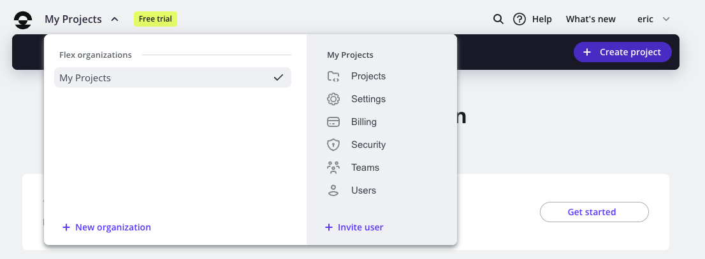

---
hide:
  - footer
title: Deploying Learning Log
---

# Deploying Learning Log

Building a Django project that works on your system is satisfying, but it gets even more satisfying when you see your site deployed where anyone can access it.

In the second half of Chapter 20, the book walks you through the process of deploying Learning Log to the hosting company Platform.sh. That company has rebranded as [Upsun](https://upsun.com), and they've changed their approach to deployment somewhat. The printed instructions no longer work for deployment, but the instructions here are fully up to date. If you run into any steps that don't seem to work, please [reach out](../contact.md) and I will update these instructions. Thank you!

## Making an Upsun Account

To make an account, go to [https://upsun.com](https://upsun.com) and click the Free Trial button. Currently, Upsun offers a 15-day free trial. At the time of this writing, a credit card is not required to use the free trial.

## Flex and Fixed plans

Upsun offers two types of deployment plans, *Flex* and *Fixed*. With a Flex plan, you can adjust the size of individual resources as your project grows. With Fixed plans, you choose an overall set of resources, and then you can upgrade those resources as a group when your project grows.

Upsun steers people towards Flex plans, but it's more expensive and not needed when you're first learning to deploy a small project.

### Adding a Fixed Organization

When you create an account on Upsun, you also create a default *Organization*. That default organization is on their Flex plan. Make a new Organization on the Fixed plan by clicking the drop down arrow next to **My Projects** on the dashboard, and then clicking **New organization**:



In the **Create organization** dialog that appears, make a name for your new organization. I used the form `<first_name>_fixed`. Make sure to change the **Organization type** to "Fixed".


Click the **Create organization** button, and you should see a confirmation that your organization is set up to use Upsun's Fixed resources:


The Upsun CLI
---

To deploy and manage a project on Platform.sh, you’ll need the tools available in the Command Line Interface (CLI). To install the latest version of the CLI, visit [https://docs.upsun.com/administration/cli.html](https://docs.upsun.com/administration/cli.html) and follow the instructions for your operating system. If you're on Windows and haven't installed something like this in a terminal before, I recommend using [Scoop](https://scoop.sh), a tool for installing utilities on Windows. Scoop makes it easy to install the Upsun CLI, and many other tools you might find helpful as you continue working on more complex programming projects.

Creating a *requirements.txt* file
---

The remote server needs to know which packages Learning Log depends on, so we’ll use pip to generate a file listing them. Again, from an active virtual environment, issue the following command:

```sh
(ll_env)learning_log$ pip freeze > requirements.txt
```

The freeze command tells pip to write the names of all the packages currently installed in the project into the file *requirements.txt*. Open this file to see the packages and version numbers installed in your project:

```txt
asgiref==3.10.0
django==5.2.8
django-bootstrap5==25.2
sqlparse==0.5.3
```

Learning Log already depends on specific versions of four different packages, so it requires a matching environment to run properly on a remote server. (We installed two of these packages manually, and two others were installed automatically as dependencies of those packages.)

When we deploy Learning Log, Upsun will install all the packages listed in *requirements.txt*, creating an environment with the same packages we’re using locally. Because of this, we can be confident the deployed project will function just like it has on our local system. This approach to managing a project is critical as you start to build and maintain multiple projects on your system.

Using Git to Track the Project's Files
---

As discussed in Chapter 17, Git is a version control program that allows you to take a snapshot of the code in your project each time you implement a new feature successfully. If anything goes wrong, you can easily return to the last working snapshot of your project; for example, if you accidentally
introduce a bug while working on a new feature. Each snapshot is called a *commit*.

Using Git, you can try implementing new features without worrying about breaking your project. When you’re deploying to a live server, you need to make sure you’re deploying a working version of your project. To read more about Git and version control, see Appendix D.

### Installing Git

Git may already be installed on your system. To find out, open a new terminal window and issue the command `git --version`:

```sh hl_lines="1"
(ll_env)learning_log$ git --version
git version 2.51.0
```

If you get a message indicating that Git is not installed, see the installation instructions in Appendix D.

### Configuring Git

Git keeps track of who makes changes to a project, even when only one person is working on the project. To do this, Git needs to know your username and email. You must provide a username, but you can make up an email for your practice projects:

```sh
(ll_env)learning_log$ git config --global user.name "eric"
(ll_env)learning_log$ git config --global user.email "eric@example.com"
```

If you forget this step, Git will prompt you for this information when you make your first commit.

### Ignoring Files

We don’t need Git to track every file in the project, so we’ll tell it to ignore some files. Create a file called *.gitignore* in the folder that contains *manage.py*. Notice that this filename begins with a dot and has no file extension. Here’s the code that goes in *.gitignore*:

```txt title=".gitignore"
.gitignore ll_env/
__pycache__/
*.sqlite3
```

We tell Git to ignore the entire *ll_env* directory, because we can re-create it automatically at any time. We also don’t track the *\__pycache__* directory, which contains the *.pyc* files that are created automatically when the *.py* files are executed. We don’t track changes to the local database, because it’s a bad habit: if you’re ever using SQLite on a server, you might accidentally overwrite the live database with your local test database when you push the project to the server. The asterisk in `*.sqlite3` tells Git to ignore any file that ends with the extension *.sqlite3*.

!!! note
    If you’re using macOS, add *.DS_Store* to your *.gitignore* file. This is a file that stores information about folder settings on macOS, and it has nothing to do with this project.

### Committing the Project

We need to initialize a Git repository for Learning Log, add all the necessary files to the repository, and commit the initial state of the project. Here’s how to do that:

```sh hl_lines="1 3 4 10 13"
(ll_env)learning_log$ git init
Initialized empty Git repository in /Users/eric/.../learning_log/.git/
(ll_env)learning_log$ git add .
(ll_env)learning_log$ git commit -am "Initial state, before deployment."
[main (root-commit) c7ffaad] Initial state, before deployment.
42 files changed, 879 insertions(+)
create mode 100644 .gitignore
--snip--
create mode 100644 requirements.txt
(ll_env)learning_log$ git status
On branch main
nothing to commit, working tree clean
(ll_env)learning_log$
```

We issue the `git init` command to initialize an empty repository in the directory containing Learning Log. We then use the `git add .` command, which adds all the files that aren’t being ignored to the repository . (Don’t forget the dot.) Next, we issue the command `git commit -am "commit message"`: the `-a` flag tells Git to include all changed files in this commit, and the `-m` flag tells Git to record a log message .

Issuing the `git status` command indicates that we’re on the *main* branch and that our working tree is *clean*. This is the status you’ll want to see anytime you push your project to a remote server.

Deploying the project
---

At this point you should have an Upsun account with an organization on the Fixed plan, and the Upsun CLI should be installed on your system. You should have a *requirements.txt* file, listing all the project's requirements. You should have made an initial Git commit, so if anything doesn't work you can restore your project to this known working state.

### Installing `django-simple-deploy`

It's time to deploy the project. We'll use `django-simple-deploy`, a tool that automates initial Django deployments. With `django-simple-deploy`, you install a plugin for the host you're working with (in this case Upsun), and it takes care of the configuration work necessary to build a working remote version of the project.

First, install `dsd-upsun`, the plugin that handles deployment to Upsun:

```sh
(ll_env)learning_log$ pip install dsd-upsun
(ll_env)learning_log$ pip freeze > requirements.txt
```

After adding a new requirement, the *requirements.txt* file needs to be updated. If you open *requirements.txt* again, you'll see that `django-simple-deploy` has been added along with `dsd-upsun`.

Now add `django_simple_deploy` to `INSTALLED_APPS`, just like you did with `django-bootstrap5` earlier:

```python hl_lines="6" title="ll_project/settings.py"
--snip--
INSTALLED_APPS = [
    --snip-
    # Third party apps.
    'django_bootstrap5',
    'django_simple_deploy',
    --snip--
```

Note that the name here is `django_simple_deploy` with underscores, even though the package name is `django-simple-deploy` with hyphens. This is the pattern that almost all third-party Python packages follow.

These changes need to be committed before making Upsun-specific configuration changes:

```sh
(ll_env)learning_log$ git commit -am "Added django-simple-deploy."
```

Frequently committing known states of a project is an important habit as your projects become more complex.

### Creating a Project on Upsun

Now it's time to make a new project on Upsun. First, authenticate with the CLI:

```sh
(ll_env)learning_log$ upsun login
```

This command should open a browser, where you can confirm the terminal-based login.

Now run the `create` command, to generate a new project on Upsun:

```sh
(ll_env)learning_log$ upsun create --title ll_project_remote
```

The new remote project needs a name. You can use any name with underscores, but it's helpful to use a name similar to what you used when running `django startproject`. At the same time, it's nice to use a name that's distinct from names that have already been used. The name `ll_project_remote` lets you distinguish between the *ll_project* directory on your local system, and the remote project on Upsun.

You'll be prompted for which organization to use; make sure to use the one that's on the Fixed plan. You'll be asked to choose a region; any one should work, but it's usually better to choose one relatively close to your location. After you've answered all the questions, you should see a dancing robot as Upsun creates the remote resources for you.

### Configuring Learning Log for Upsun

Now you have a project that works locally, and an empty project on Upsun's servers. The project needs some new files and configuration changes in order to work on Upsun. You can add those files manually, but it's easy to make a small mistake like a typo, or miss a required file. These simple mistakes can take a long time to sort out, even for experienced developers, because every hosting platform has slightly different requirements.

`django-simple-deploy` avoids that issue by making all the necessary changes for you. Running the `manage.py deploy` command makes those configuration changes:

```sh
(ll_env)learning_log$ python manage.py deploy --deployed-project-name ll_project_remote
```

You need to tell `django-simple-deploy` the name of the project on `Upsun`, and the `--deployed-project-name` argument lets you do that. After running this command, you should see a summary of the changes that were made to your project in preparation for pushing it to Upsun. `django-simple-deploy` looks for a clean Git status before it makes configuration changes, so if you forgot to run `git commit` before calling `deploy`, you might have to make another commit and then run `deploy` a second time.

### Reviewing and committing configuration changes

An external tool has just made a number of changes to your project. Another strength of Git is that it lets you see exactly what changes were made:

```sh hl_lines="1"
(ll_env)learning_log$ git status
	modified:   .gitignore
	modified:   ll_project/settings.py
	modified:   requirements.txt

Untracked files:
	.platform.app.yaml
	.platform/
```

This output shows that three files were modified, and some new files were added. You can see what changes were made by running `git diff <file-path>`. For example, here's the changes made to the *settings.py* file:

```sh
(ll_env)learning_log$ git diff ll_project/settings.py

```

It takes a little to get used to the format of a `git diff` listing. If what you see isn't entirely clear, look at this output and then look at the file in your text editor. The `git diff` output should show you where to focus your attention in the file.

The important part to notice here is that a conditional block has been added to the end of the settings file. Briefly, if the project is running in an Upsun environment, these settings will override the settings that were defined earlier in the file. Those settings will still work on your system, but the Upsun-specific settings will take effect in the Upsun environment.

If you run `git diff` against the other files listed you'll see that a *dsd_logs* directory is being ignored, and a couple requirements were added that need to be installed in Upsun's environment.

You can open the other files in your text editor and see what was added. These files tell Upsun how to build the project in their remote environment, and which resources to attach to the project. The *.platform* name appears here because Upsun has not fully transitioned away from their former name, Platform.sh.

When you're finished reviewing the changes that were made, make a new commit:

```sh  hl_lines="1-3"
(ll_env)learning_log$ git add .
(ll_env)learning_log$ git commit -am "Configured for deployment to Upsun."
(ll_env)learning_log$ git status
On branch main
nothing to commit, working tree clean
```

It's a good habit to check `git status` after committing more significant changes, to make sure you haven't missed anything. It's quite easy, for example, to forget to run `git add` and find that you've got a few files that haven't actually been committed yet.

### Pushing the project to Upsun

Now it's time to push the project to Upsun:

```sh
(ll_env)learning_log$ upsun push
```

This command pushes all your project's files to Upsun's servers. It also causes Upsun to set up an environment from which the project can be served to end users. It installs the project's requirements, runs the database migrations, and starts listening for requests. This process can take about 3-10 minutes.

When your project has been pushed, you can open it with the `url` command:

```sh
(ll_env)learning_log$ upsun url
```


When you run this command, you'll be shown a couple URLs where your project can be seen. Enter `0`, and your project will open in a new browser tab:
[screenshot, with remote URL highlighted]

This looks just like the project does when you used the `runserver` command, but now anyone can access your project. If you want someone else to try it out, just share the URL as you would for any web site you want to share.

Upsun created a new database when it built the project; none of the data that you entered locally was copied over to the remote project. Take a moment to register an account on your deployed instance of Learning Log.

### Creating a superuser

When you maintain a deployed project, you'll almost certainly want access to the Django admin site. For that, you need a superuser. The `ssh` command lets you run the same terminal commands you were using locally, on the remote project:

```sh
(ll_env)learning_log$ upsun ssh
$ ls
$ python manage.py createsuperuser
ll_admin_remote
exit
(ll_env)learning_log$ 
```

When you first run the platform environment:ssh command, you may get another prompt about the authenticity of this host. If you see this message, enter Y and you should be logged in to a remote terminal session.

After running the ssh command, your terminal acts just like a terminal on the remote server. Note that your prompt has changed to indicate that you’re in a web session associated with the project named ll_project . If you issue the ls command, you’ll see the files that have been pushed to the Platform.sh server.

Issue the same createsuperuser command we used in Chapter 18 . This time, I entered an admin username, ll_admin_live, that’s distinct from the one I used locally . When you’re finished working in the remote terminal session, enter the exit command . Your prompt will indicate that you’re working in your local system again.

Now you can add /admin/ to the end of the URL for the live app and log in to the admin site. If others have already started using your project, be aware that you’ll have access to all their data! Take this responsibility seriously, and users will continue to trust you with their data.

!!! note
    Windows users will use the same commands shown here (such as ls instead of dir), because you’re running a Linux terminal through a remote connection.

Finishing Chapter 20
---

You can now go back to the book and pick up on page 459, at the *Creating Custom Error Pages* section. The only difference you’ll need to keep in mind is that you’ll use the `upsun` whenever you see the command `platform` used in the book. Also, any reference to Platform.sh should be read as a reference to Upsun.

---

If any of the steps shown here do not work and you can't figure out how to proceed, please [reach out](../contact.md). I would like to keep these instructions up to date, and I always enjoy hearing from people. :)
