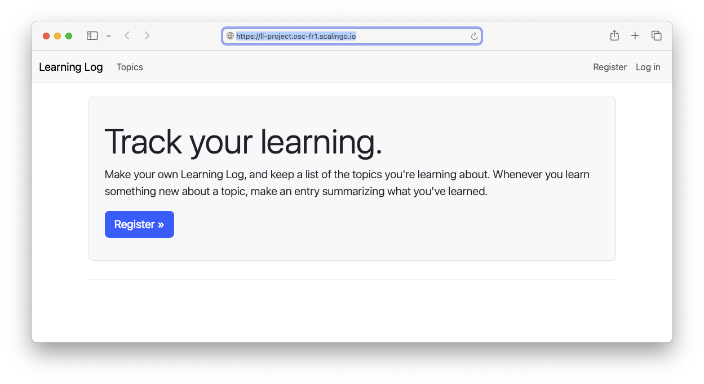
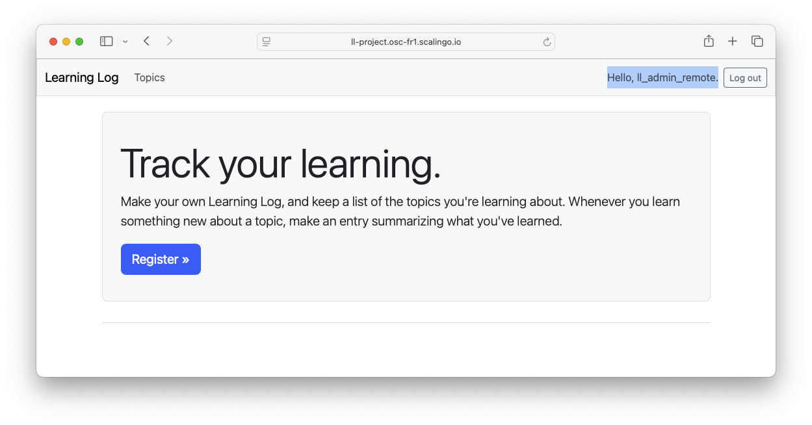
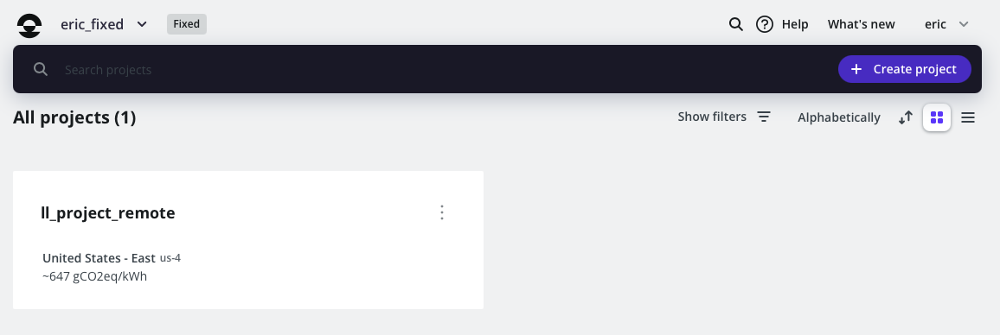
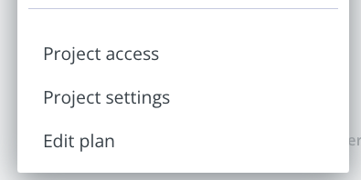
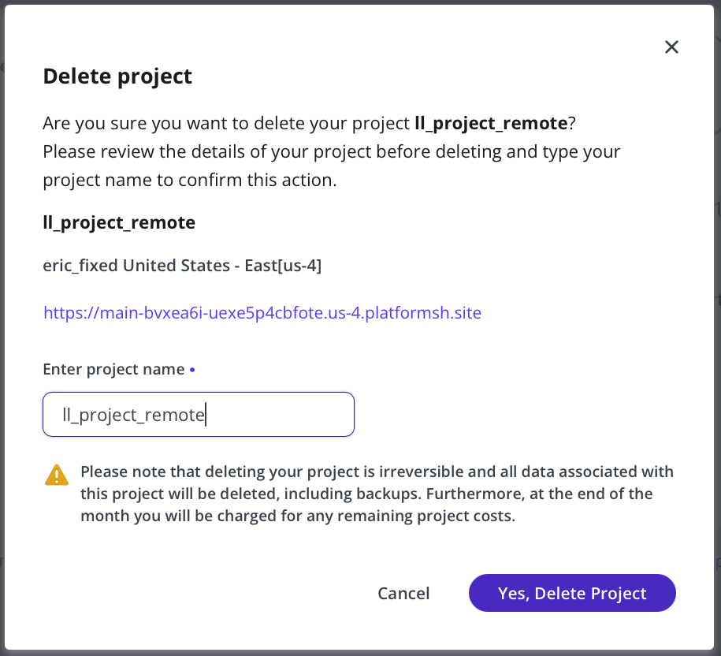

---
hide:
  - footer
title: Deploying Learning Log
---

# Deploying Learning Log

Building a Django project that works on your system is satisfying, but it gets even more satisfying when you see your site deployed where anyone can access it.

In the second half of Chapter 20, the book walks you through the process of deploying Learning Log to the hosting company Platform.sh. That company has rebranded as Upsun, but they've changed their approach to deployment so much that I can no longer recommend them as a host for people who are learning about deployment. However, [Scalingo](https://scalingo.com) is a modern web hosting platform that supports Django. Scalingo also offers a 30-day free trial that doesn't require a credit card. This is perfect for learning about deployment.

The instructions here should be fully up to date. If you run into any steps that don't seem to work, please [reach out](../contact.md) and I will try to update these instructions. Thank you!

Making a Scalingo Account
---

To make an account, go to [https://scalingo.com](https://scalingo.com) and click the Free Trial button. You can practice the deployment process for 30 days. If you want to keep a project live longer than the 30-day period, you'll need to start paying for hosting.

!!! note
    Many hosting companies used to offer free trials, without requiring users to set up a payment method. With the growth of cryptocurrency miners, bot networks, and a rapid rise in abusive users, almost every company now requires users to set up a payment method as an anti-abuse measure.

The Scalingo CLI
---

To deploy and manage a project on Scalingo, you’ll need the tools available in the Command Line Interface (CLI). To install the latest version of the CLI, visit [https://doc.scalingo.com/tools/cli/start](https://doc.scalingo.com/tools/cli/start) and follow the instructions for your operating system.

SSH Keys
---

Every hosting provider needs a way to establish trusted communications between your computer and their servers. SSH keys are one way to manage this kind of communication. To do this, you make a pair of keys; one is private, and the other is public. The private key never leaves your system. The public key is copied to the hosting provider, and the SSH protocol is used to verify communication between the two systems from that point forward.

Scalingo requires a copy of your public key before you can copy your project. To create a key pair and upload your public key to Scalingo, see their [SSH Key Setup](https://doc.scalingo.com/platform/getting-started/first-steps#ssh-key-setup) instructions.

Creating a *requirements.txt* file
---

The remote server needs to know which packages Learning Log depends on, so we’ll use pip to generate a file listing them. Again, from an active virtual environment, issue the following command:

```sh hl_lines="1"
(ll_env)learning_log$ pip freeze > requirements.txt
```

The freeze command tells pip to write the names of all the packages currently installed in the project into the file *requirements.txt*. Open this file to see the packages and version numbers installed in your project:

```txt title="File: requirements.txt"
asgiref==3.10.0
django==5.2.8
django-bootstrap5==25.2
sqlparse==0.5.3
```

Learning Log already depends on specific versions of four different packages, so it requires a matching environment to run properly on a remote server. (We installed two of these packages manually, and two others were installed automatically as dependencies of those packages.)

When we deploy Learning Log, Scalingo will install all the packages listed in *requirements.txt*, creating an environment with the same packages we’re using locally. Because of this, we can be confident the deployed project will function just like it has on our local system. This approach to managing a project is critical as you start to build and maintain multiple projects on your system.

Using Git to Track the Project's Files
---

As discussed in Chapter 17, Git is a version control program that allows you to take a snapshot of the code in your project each time you implement a new feature successfully. If anything goes wrong, you can easily return to the last working snapshot of your project; for example, if you accidentally introduce a bug while working on a new feature. Each snapshot is called a *commit*.

Using Git, you can try implementing new features without worrying about breaking your project. When you’re deploying to a live server, you need to make sure you’re deploying a working version of your project. To read more about Git and version control, see Appendix D.

### Installing Git

Git may already be installed on your system. To find out, open a new terminal window and issue the command `git --version`:

```sh hl_lines="1"
(ll_env)learning_log$ git --version
git version 2.51.0
```

If you get a message indicating that Git is not installed, see the installation instructions in Appendix D.

### Configuring Git

Git keeps track of who makes changes to a project, even when only one person is working on the project. To do this, Git needs to know your username and email. You must provide a username, but you can make up an email for your practice projects:

```sh hl_lines="1 2"
(ll_env)learning_log$ git config --global user.name "eric"
(ll_env)learning_log$ git config --global user.email "eric@example.com"
```

If you forget this step, Git will prompt you for this information when you make your first commit.

### Ignoring Files

We don’t need Git to track every file in the project, so we’ll tell it to ignore some files. Create a file called *.gitignore* in the folder that contains *manage.py*. Notice that this filename begins with a dot and has no file extension. Here’s the code that goes in *.gitignore*:

```txt title="File: .gitignore"
ll_env/
__pycache__/
*.sqlite3
```

We tell Git to ignore the entire *ll_env* directory, because we can re-create it automatically at any time. We also don’t track the *\__pycache__* directory, which contains the *.pyc* files that are created automatically when the *.py* files are executed. We don’t track changes to the local database, because it’s a bad habit: if you’re ever using SQLite on a server, you might accidentally overwrite the live database with your local test database when you push the project to the server. The asterisk in `*.sqlite3` tells Git to ignore any file that ends with the extension *.sqlite3*.

!!! note
    If you’re using macOS, add *.DS_Store* to your *.gitignore* file. This is a file that stores information about folder settings on macOS, and it has nothing to do with this project.

### Committing the Project

We need to initialize a Git repository for Learning Log, add all the necessary files to the repository, and commit the initial state of the project. Here’s how to do that:

```sh hl_lines="1 3 4 10 13"
(ll_env)learning_log$ git init
Initialized empty Git repository in /Users/eric/.../learning_log/.git/
(ll_env)learning_log$ git add .
(ll_env)learning_log$ git commit -am "Initial state, before deployment."
[main (root-commit) c7ffaad] Initial state, before deployment.
42 files changed, 879 insertions(+)
create mode 100644 .gitignore
--snip--
create mode 100644 requirements.txt
(ll_env)learning_log$ git status
On branch main
nothing to commit, working tree clean
(ll_env)learning_log$
```

We issue the `git init` command to initialize an empty repository in the directory containing Learning Log. We then use the `git add .` command, which adds all the files that aren’t being ignored to the repository . (Don’t forget the dot.) Next, we issue the command `git commit -am "commit message"`: the `-a` flag tells Git to include all changed files in this commit, and the `-m` flag tells Git to record a log message .

Issuing the `git status` command indicates that we’re on the *main* branch and that our working tree is *clean*. This is the status you’ll want to see anytime you push your project to a remote server.

Deploying the project
---

At this point you should have a Scalingo account, and the Scalingo CLI should be installed on your system. You should have a *requirements.txt* file, listing all the project's requirements. You should have made an initial Git commit, so if anything doesn't work you can restore your project to this known working state.

### Installing `django-simple-deploy`

It's time to deploy the project. We'll use `django-simple-deploy`, a tool that automates initial Django deployments. With `django-simple-deploy`, you install a plugin for the host you're working with (in this case Scalingo), and it takes care of the configuration work necessary to build a working remote version of the project.

!!! note
    Disclaimer: I'm the maintainer of `django-simple-deploy`. I created this project after watching countless Django developers struggle with the initial deployment process. It's not just for beginners; it helps *everyone* avoid typos and other small mistakes that cause so many deployment attempts to fail. The full documentation for `django-simple-deploy` can be found [here](https://django-simple-deploy.readthedocs.io/en/latest/).

First, install `dsd-scalingo`, the plugin that handles deployment to Scalingo:

```sh hl_lines="1 2"
(ll_env)learning_log$ pip install dsd-scalingo
(ll_env)learning_log$ pip freeze > requirements.txt
```

After adding a new requirement, the *requirements.txt* file needs to be updated. If you open *requirements.txt* again, you'll see that `django-simple-deploy` has been added along with `dsd-scalingo`.

Now add `django_simple_deploy` to `INSTALLED_APPS`, just like you did with `django-bootstrap5` earlier:

```python hl_lines="6" title="File: ll_project/settings.py"
--snip--
INSTALLED_APPS = [
    --snip-
    # Third party apps.
    'django_bootstrap5',
    'django_simple_deploy',
    --snip--
```

Note that the name here is `django_simple_deploy` with underscores, even though the package name is `django-simple-deploy` with hyphens. This is the pattern that almost all third-party Python packages follow.

These changes need to be committed before making Scalingo-specific configuration changes:

```sh hl_lines="1"
(ll_env)learning_log$ git commit -am "Added django-simple-deploy."
```

Frequently committing known states of a project is an important habit as your projects become more complex.

### Deploying Learning Log

The simplest way to deploy your project is to use the fully automated workflow from django-simple-deploy. This will inspect your system to make sure the CLI is installed and authenticated, it will check that Scalingo has a copy of your public SSH key, it will make the necessary changes to your project, it will commit those changes, and it will push your project to Scalingo's servers. You should see your project appear in a new browser tab.

First, make sure you're logged in to the Scalingo CLI:

```sh hl_lines="1"
$ scalingo login
```

Now, run the `deploy` command, in the fully-automated mode:

```sh hl_lines="1"
$ python manage.py deploy --automate-all
Configuring project for deployment...
Logging run of `manage.py deploy`...
...

```

You'll need to confirm what's about to be done, and you'll see a bunch of output scroll by. You should see the deployed version of the project:



The project looks the same as it did when using the `runserver` command, but now anyone can access the project. If you want someone else to try it out, just share the URL as you would for any web site you want to share.

Scalingo created a new database when it built the project, so none of the data you entered locally was copied over to the remote project. Take a moment to register an account on your deployed instance of Learning Log. If you can register an account, you'll know your database is working correctly.

### Understanding the Deployed Project

Now that the project is deployed, let's see how it works. Let's first look at the state of the project after deployment:

```sh hl_lines="1"
$ git log --pretty=oneline
080714 (HEAD -> main, scalingo/main) Configured project for deployment.
cbc1c6 Added django-simple-deploy.
fba05c Initial state, before deploying.
```

The `--pretty=oneline` argument for `git log` generates a more concise summary of the history of the project. There was one commit made for the deployment. We can see which files were changed by comparing the current state of the project to the previous state:

```sh hl_lines="1"
$ git diff HEAD^ --name-only
.gitignore
.python-version
Procfile
bin/post_deploy.sh
ll_project/settings.py
requirements.txt
```

The command `git diff` lets you examine the difference between any two commits, or states of the project. When you're using Git, `HEAD` refers to the current state of the project, and `HEAD^` means "one commit behind the current state". The `--name-only` argument tells Git to only show the names of the files that have changed, without showing how each file was changed.

In this case, several new files were added, and some files were changed. You can use `git diff` to examine the changes that were made to a single file:

```sh hl_lines="1"
$ git diff HEAD^ ll_project/settings.py
...
```

A section was added to the end of the file. Here's the block that was added to *settings.py*:

```python  hl_lines="1"
$ git diff HEAD^ ll_project/settings.py 
...
 LOGIN_URL = 'accounts:login'
+
+
+# Scalingo settings.
+import os
+if "scalingo" in os.environ.get("STACK", ""):
+    import dj_database_url

```

Using `git diff` is helpful, and the more you use it the easier you'll be able to read the output format. Here's the full block that was added to settings.py:

```python title="File: ll_project/settings.py" hl_lines="4-34"
--snip--
LOGIN_URL = 'accounts:login'

# Scalingo settings.
import os
if "scalingo" in os.environ.get("STACK", ""):
    import dj_database_url

    DEBUG = True

    DATABASES = {
        "default": dj_database_url.config(
            env="DATABASE_URL",
            conn_max_age=600,
            conn_health_checks=True,
            ssl_require=True,
        ),
    }

    STATIC_ROOT = 'staticfiles'
    STATIC_URL = '/static/'

    STATICFILES_DIRS = (
        os.path.join(BASE_DIR, 'static'),
    )

    MIDDLEWARE.insert(1, "whitenoise.middleware.WhiteNoiseMiddleware")

    STORAGES = {
        "staticfiles": {
            "BACKEND": "whitenoise.storage.CompressedManifestStaticFilesStorage",
        },
    }
    ALLOWED_HOSTS = ["*"]
```

The settings in this block only take effect on Scalingo; they don't affect the project when you run it on your system using `runserver`. These settings make sure that debugging information is not shown when an error occurs in the deployed version of the project. The `DATABASES` dictionary configures the deployed project to use the live database. The rest of this block handles static files such as JavaScript and CSS files, and makes sure the project can be served from the remote host.

I encourage you to look at the other files that were modified, and the new files that were created as well. Some of it will make sense right away, and the more you look at these files the better you'll understand the configuration that's necessary to support the live version of a project.

### Creating a superuser

When you maintain a deployed project, you'll almost certainly want access to the Django admin site. For that, you need a superuser. The `run` command lets you run the same terminal commands you were using locally, on the remote project:

```sh hl_lines="1 4"
(ll_env)learning_log$ scalingo run python manage.py createsuperuser
-----> Starting container one-off-1178  Done in 0.101 seconds
...
Username (leave blank to use 'appsdeck'): ll_admin_remote
Email address: 
Password: 
Password (again): 
Superuser created successfully.
```

When you run a command that requires user input, Scalingo opens a connection to the server. While the command is running, your terminal acts just like a terminal on the remote server. This is the same `createsuperuser` command we used in Chapter 18 . This time, I entered an admin username, `ll_admin_remote`, that’s distinct from the one I used locally.

Now you can add `/admin/` to the end of the URL for the live app and log in to the admin site. If others have already started using your project, be aware that you’ll have access to all their data! Take this responsibility seriously, and users will continue to trust you with their data.



Pushing Further Changes
---

Here's the last part of the output from running `deploy`:

```sh
2026-03-24 12:22:39,593 INFO: --- Your project should now be deployed on Scalingo ---
2026-03-24 12:22:39,593 INFO: 
2026-03-24 12:22:39,593 INFO: It should have opened up in a new browser tab. If you see a
2026-03-24 12:22:39,593 INFO:   "server not available" message, wait a minute or two and
2026-03-24 12:22:39,593 INFO:   refresh the tab. It sometimes takes a few minutes for the
2026-03-24 12:22:39,593 INFO:   server to be ready.
2026-03-24 12:22:39,593 INFO: - You can also visit your project at https://ll-project.osc-fr1.scaling.io
2026-03-24 12:22:39,594 INFO: 
2026-03-24 12:22:39,594 INFO: If you make further changes and want to push them to Scalingo,
2026-03-24 12:22:39,594 INFO: commit your changes and then run `git push scalingo main`.
```

This tells you some important information about your deployed project. It includes your project's URL, instructions for how to push new versions of your project to the remote server, and how to run `manage.py` commands. If this information is no longer showing in your terminal, you can find a copy of it in the `dsd_logs/` directory that was added to the project.

Finishing Chapter 20
---

You can now go back to the book and pick up on page 459, at the *Creating Custom Error Pages* section. The only difference you’ll need to keep in mind is that you’ll use the command `git push scalingo main` whenever you see want to push a new version of your project to the remote server.

For more specific information about deploying Django projects to Scalingo, see the guide [Get Started with Django on Scalingo](https://doc.scalingo.com/languages/python/django/start).

Destroying the remote project
---

You probably don't want to pay for an ongoing deployed version of the Learning Log project. You can destroy the remote project, and you'll have the remainder of your free trial to either go through the process again, or try deploying a different project. 

### Deleting with the CLI

In your local project environment, you can use the `destroy` command to destroy your remote project:

```sh hl_lines="1 10 11"
$ scalingo destroy
...
```

This is a reliable way to destroy your project. However, you should log in to [https://scalingo.com](https://scalingo.com) and visit your dashboard to verify you don't have any active resources remaining.

### Deleting through the Scalingo dashboard

Every hosting company I've ever worked with has a browser-based dashboard. Some are more complex than others, so make sure you poke around and see how your host's dashboard is organized.

On Scalingo, visit [https://scalingo.com](https://scalingo.com). Here's what that page looks like after deploying Learning Log:



If you click the three vertical dots, you should see an option labeled **Edit plan**:



Click **Edit plan**, scroll down, and click **Delete project**. You'll see a dialog for confirming the deletion:



Once you enter the project name, you can click the button labeled **Yes, Delete Project**.

You should see an empty dashboard after confirming the deletion. If you see the message "Create your first project", your deletion was almost certainly successful. I've run many test deployments on Upsun, and seen many odd errors and messages along the lines of "Something went wrong." If you see anything like this, just go back to [https://console.upsun.com](https://console.upsun.com). If you see any remaining resources, click those three vertical dots, or look for a Settings tab. You usually have to scroll to the bottom of a page to find the Delete button, but it should be there.

---

If any of the steps shown here don't work and you can't figure out how to proceed, please [reach out](../contact.md). I would like to keep these instructions up to date, and I always enjoy hearing from people. :)
